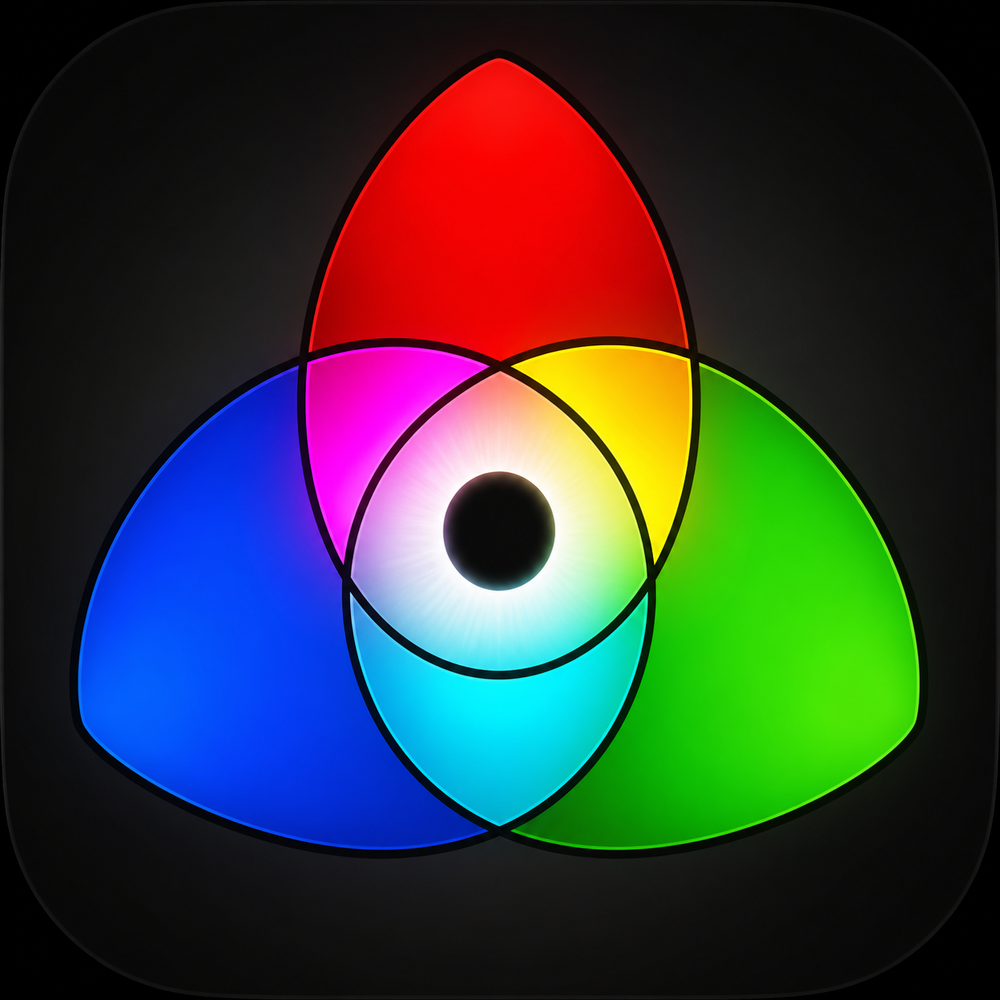

# Color Analyzer 0.1.0 CPU

Windows x64 纯 CPU 静帧色彩分析器便携版。

## Run

1. Download or clone this repository.
2. Keep the complete directory structure intact.
3. Run `Color Analyzer.exe`.

Supported systems: Windows 10 22H2 or Windows 11 x64.

The portable build does not require installing Qt, OpenImageIO, CUDA Toolkit, CMake, Visual Studio, or NVIDIA drivers.

## Features

- Open, drag, paste, screen-capture, and export still images.
- RGB, waveform, vectorscope, histogram, and 12-color palette analysis.
- Built-in color profiles, transfer functions, LUT loading, and color-space conversion.
- 8/10/12/16-bit image workflows, including DPX decoding through OpenImageIO.
- Latest-request scheduling for responsive interaction during repeated adjustments.

## CPU-only performance path

- Large frames use bounded CPU parallel accumulation for scopes.
- Palette extraction overlaps scope calculation on large frames.
- Waveform column mapping is cached by resolution.
- The analysis executable contains no CUDA backend or CUDA runtime dependency.

## Application icon

The current RGB additive icon is available as:

- `color_analyzer_rgb_additive_kaleidoscope_v2.png` — source artwork.
- `color_analyzer_rgb_additive_kaleidoscope_v2.ico` — Windows icon resource.

The ICO is embedded into `Color Analyzer.exe`; the PNG is included for documentation and reuse.

## Notes

Do not separate the executable from its Qt plugin folders, OpenImageIO DLLs, or Microsoft runtime DLLs. This repository is a ready-to-run portable distribution rather than the C++ development source tree.

The bundled third-party runtime libraries remain subject to their respective licenses.

## Installer

For a per-user Windows installation with a Start Menu shortcut, run:

[`installer/Color-Analyzer-0.1.0-Setup.exe`](installer/Color-Analyzer-0.1.0-Setup.exe)

See [`INSTALLER.md`](INSTALLER.md) for installation details and rebuild instructions.
